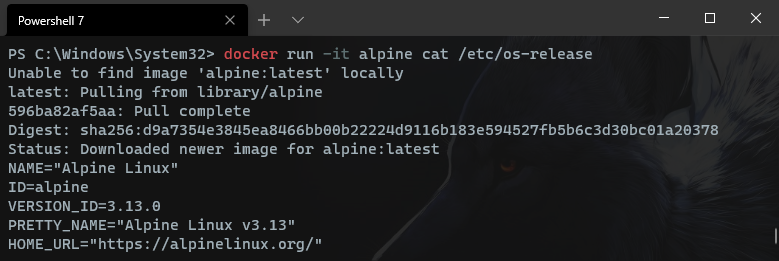

I had a need to obtain this information to figure out "generically" what shape I could expect to find this information in.
FreeDesktop.org [specifies an expected format](https://www.freedesktop.org/software/systemd/man/os-release.html), but as a best practice I prefer evidence over assumptions.

<!--more-->


After futher perusal for yet more /etc/os-release information, I sumbled upon [this GitHub Repository by higanworks](https://github.com/higanworks/os_catalog) that is much more complete,
and well maintained. Give it a look!


## Debian
`docker run -it debian cat /etc/os-release`
>PRETTY_NAME="Debian GNU/Linux 10 (buster)"  
>NAME="Debian GNU/Linux"  
>VERSION_ID="10"  
>VERSION="10 (buster)"  
>VERSION_CODENAME=buster  
>ID=debian  
>HOME_URL="https://www.debian.org/"  
>SUPPORT_URL="https://www.debian.org/support"  
>BUG_REPORT_URL="https://bugs.debian.org/"  

## Ubuntu
`docker run -it ubuntu cat /etc/os-release`
>NAME="Ubuntu"  
>VERSION="20.04.1 LTS (Focal Fossa)"  
>ID=ubuntu
>ID_LIKE=debian  
>PRETTY_NAME="Ubuntu 20.04.1 LTS"  
>VERSION_ID="20.04"  
>HOME_URL="https://www.ubuntu.com/"  
>SUPPORT_URL="https://help.ubuntu.com/"  
>BUG_REPORT_URL="https://bugs.launchpad.net/ubuntu/"  
>PRIVACY_POLICY_URL="https://www.ubuntu.com/legal/terms-and-policies/privacy-policy"  
>VERSION_CODENAME=focal  
>UBUNTU_CODENAME=focal  

## Fedora  
`docker run -it fedora cat /etc/os-release`
>NAME=Fedora  
>VERSION="33 (Container Image)"  
>ID=fedora  
>VERSION_ID=33  
>VERSION_CODENAME=""  
>PLATFORM_ID="platform:f33"  
>PRETTY_NAME="Fedora 33 (Container Image)"  
>ANSI_COLOR="0;38;2;60;110;180"  
>LOGO=fedora-logo-icon  
>CPE_NAME="cpe:/o:fedoraproject:fedora:33"  
>HOME_URL="https://fedoraproject.org/"  
>DOCUMENTATION_URL="https://docs.fedoraproject.org/en-US/fedora/f33/system-administrators-guide/"  
>SUPPORT_URL="https://fedoraproject.org/wiki/Communicating_and_getting_help"  
>BUG_REPORT_URL="https://bugzilla.redhat.com/"  
>REDHAT_BUGZILLA_PRODUCT="Fedora"  
>REDHAT_BUGZILLA_PRODUCT_VERSION=33  
>REDHAT_SUPPORT_PRODUCT="Fedora"  
>REDHAT_SUPPORT_PRODUCT_VERSION=33  
>PRIVACY_POLICY_URL="https://fedoraproject.org/wiki/Legal:PrivacyPolicy"  
>VARIANT="Container Image"  
>VARIANT_ID=container  

## RHEL
[Source](https://linuxconfig.org/how-to-check-redhat-version)  
>NAME="Red Hat Enterprise Linux Server"  
>VERSION="7.3 (Maipo)"  
>ID="rhel"  
>ID_LIKE="fedora"  
>VERSION_ID="7.3"  
>PRETTY_NAME="Red Hat Enterprise Linux Server 7.3 (Maipo)"  
>ANSI_COLOR="0;31"  
>CPE_NAME="cpe:/o:redhat:enterprise_linux:7.3:GA:server"  
>HOME_URL="https://www.redhat.com/"  
>BUG_REPORT_URL="https://bugzilla.redhat.com/"  
>  
>REDHAT_BUGZILLA_PRODUCT="Red Hat Enterprise Linux 7"  
>REDHAT_BUGZILLA_PRODUCT_VERSION=7.3  
>REDHAT_SUPPORT_PRODUCT="Red Hat Enterprise Linux"  
>REDHAT_SUPPORT_PRODUCT_VERSION="7.3"  

## openSUSE Leap
`docker run -it opensuse/leap cat /etc/os-release`  
>NAME="openSUSE Leap"  
>VERSION="15.2"  
>ID="opensuse-leap"  
>ID_LIKE="suse opensuse"  
>VERSION_ID="15.2"  
>PRETTY_NAME="openSUSE Leap 15.2"  
>ANSI_COLOR="0;32"  
>CPE_NAME="cpe:/o:opensuse:leap:15.2"  
>BUG_REPORT_URL="https://bugs.opensuse.org"  
>HOME_URL="https://www.opensuse.org/"  

## Alpine  
`docker run -it alpine cat /etc/os-release`  
>NAME="Alpine Linux"  
>ID=alpine  
>VERSION_ID=3.13.0  
>PRETTY_NAME="Alpine Linux v3.13"  
>HOME_URL="https://alpinelinux.org/"  
>BUG_REPORT_URL="https://bugs.alpinelinux.org/"  

## Linux Mint
[Source](https://www.tecmint.com/upgrade-to-linux-mint-20/)  
>NAME="Linux Mint"  
>VERSION="20 (Ulyana)"  
>ID=linuxmint  
>ID_LIKE=ubuntu  
>PRETTY_NAME="Linux Mint 20"  
>VERSION_ID="20"  
>HOME_URL="https://www.linuxmint.com"  
>SUPPORT_URL="https://forums.ubuntu.com/"  
>BUG_REPORT_URL="http://linuxmint-troubleshooting-guide.readthedocs.io/en/latest/"  
>PRIVACY_POLICY_URL="https://linuxmint.com"  
>VERSION_CODENAME=ulyana  
>UBUNTU_CODENAME=focal  